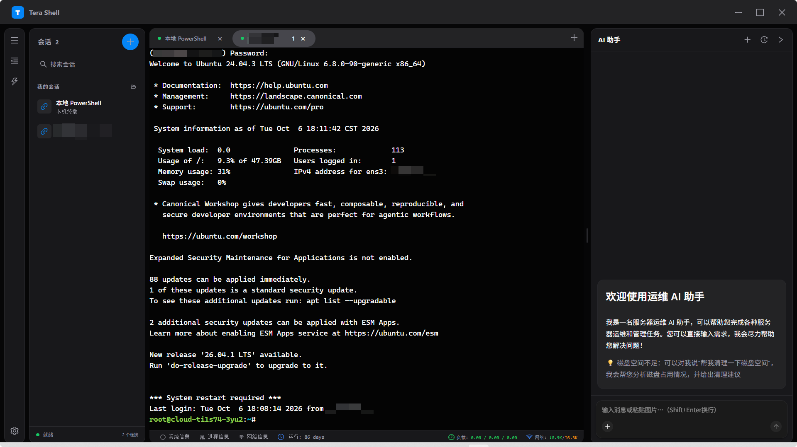

<div align="center">

# Tera Shell

**把 AI 助手装进终端的 Windows SSH / 本地终端工作台**

基于 Tauri 2 · React 19 · xterm.js 6 · Rust

</div>

---

## 简介

Tera Shell 是一个开源的 Windows 桌面终端，把**本地 PowerShell** 与 **SSH 远程服务器**整合进同一个多标签工作区，并内置了一个与终端深度融合的 **AI 运维助手**。

它对标商业 SSH 工具的 AI 交互体验，但模型完全走你自己配置的本地供应商 —— 不依赖任何账号体系，数据全部留在本机。

## ✨ 核心特色

### 🤖 与终端深度融合的 AI 助手

- **run_command 工具循环**：AI 可以直接在当前会话连接的服务器上执行命令，输出自动回填继续对话 —— 不是"告诉你怎么敲"，而是"替你敲完并看着结果接着想"
- **`/?` 命令解释**：在终端里输入 `git rebase -i /?` 回车，AI 解释以打字机效果直接打印在终端里，不用切换任何窗口
- **执行卡片双通道**：命令可写入当前终端执行（输出可见），也可走独立后台通道；配合「自动执行 / 自动应用」开关与**命令黑名单**（`rm`、`kill` 等默认拦截），安全与效率自己权衡
- **本地模型供应商**：兼容 OpenAI / Anthropic / Responses 三种 API 协议，多供应商多模型自由切换，API Key 只存在你自己的电脑上

### ⌨️ PSReadLine 风格命令补全

输入行末尾实时挂出灰色 ghost text 建议（命令历史 + 内置常用命令字典），`→` 整句接受、`Ctrl+→` 按词接受 —— 把 PowerShell 7 的内联预测体验带给每台你连上的 Linux 服务器，无需在远端安装任何东西。

### 🖥️ 终端增强

- **cat 代码高亮**：`cat` 一个源码文件，自动经语法着色后以 One Dark Pro 配色渲染进终端
- **vim 配色自动部署**：连接 SSH 后自动把 One Dark Pro 配色部署到远端 `~/.vim/plugin`，vim 打开即有配色
- **终端内查找**：`Ctrl+F` 浮层查找，支持正则与大小写切换，不打断输入焦点
- **干净的选区**：自绘选区覆盖层只标记实际文字，杜绝 xterm 误选行尾空白

### 🔐 安全与数据本地优先

- **SSH 免密直连**：密码经 Windows DPAPI 加密后落盘（绑定当前 Windows 用户，换机器无法解密），首次输入，之后双击会话直接连接
- **所有数据一个目录**：会话、设置、模型配置、快捷宏、AI 历史、命令历史、面板偏好统一存放在 `~/.tera-shell/`，支持自定义数据目录一键迁移 —— 卸载重装、换电脑，拷走目录就等于带走一切

### 🧩 工作台体验

- **多标签 + 拆分**：每个会话独立 PTY 进程，切换标签移动 DOM 节点而非重建，滚动历史与光标位置全保留；支持 VS Code 式向右拆分双栏，标签可跨栏拖拽
- **SFTP 独立窗口**：每个 SFTP 会话开一个真正的系统窗口，可并排摆放；远程文件可调用本地程序编辑，保存后自动回传远端
- **快捷宏 ⇆ 信息栏**：底部状态栏一键切换形态 —— 宏模式下常用命令一键执行，信息栏模式下实时展示系统 / 进程 / 网络三抽屉真值
- **专注模式**：右键一键全屏只留终端，抽屉、面板全部让位

## 🚀 功能总览

- 🚀 Tauri 2 + Rust 后端：portable-pty 驱动本地 PowerShell，russh 驱动 SSH
- 🚀 React 19 + TypeScript 严格模式 + xterm.js 6（WebGL 渲染）
- 🚀 多标签会话：新建 SSH / 打开本地终端 / 复制会话 / 断线状态标记
- 🚀 AI 助手面板：流式对话、执行卡片、图片、历史任务、一键存为宏，面板可拖宽、可收起为右缘浮窗
- 🚀 命令补全、终端查找、cat 高亮、vim 配色、右键菜单、专注模式
- 🚀 快捷宏管理面板：增删改、拖拽排序、恢复默认
- 🚀 系统 / 进程 / 网络信息抽屉，信息栏真值轮询
- 🚀 多套内置配色方案，字体 / 字号 / 亮暗主题设置
- 🚀 无边框自绘窗口：开屏动效遮住启动白屏，WebView2 快捷键统一接管
- 🚀 ESLint + Prettier + Stylelint + commitlint 全链路代码规范，vitest 单元测试

## 🛠️ 技术栈

| 层          | 技术                                                                     |
| ----------- | ------------------------------------------------------------------------ |
| 桌面框架    | Tauri 2（Rust）                                                          |
| 前端        | React 19 · TypeScript · HeroUI · SCSS                                    |
| 终端        | xterm.js 6（WebGL / fit / search / unicode11 addon）                     |
| 后端能力    | portable-pty（本地 PTY）· russh（SSH / SFTP）· cli-highlight（语法着色） |
| 安全        | Windows DPAPI（凭据加密）                                                |
| 测试 / 规范 | Vitest · ESLint · Prettier · Stylelint · commitlint                      |

## 📦 快速开始

环境要求：Windows 10/11、Node.js 20+、pnpm、Rust stable。

```bash
# 安装依赖
pnpm install

# 开发模式（前端 Vite + 后端 Rust 双热更新）
pnpm tauri dev

# 生产构建 / 打包
pnpm build
pnpm tauri build

# 单元测试
pnpm test
```

提交请使用 `pnpm commit`（commit-msg 钩子会拒绝直接 `git commit`，提交主题需中文开头）。

## 📂 项目结构

```
src/
  app/            # 应用外壳（标题栏菜单、侧栏竖条、窗口控制）
  terminal/       # 终端核心：会话生命周期、AI 助手、命令补全、宏、信息抽屉
  sessions/       # 会话侧栏与持久化
  sftp/           # SFTP 独立窗口、文件浏览、远程编辑回传
  settings/       # 设置页（外观 / 模型供应商 / 数据目录）与 i18n
  shared/         # 通用组件（Toggle、Hint、ConfirmDialog）
  styles/         # 按功能域拆分的 SCSS partials
src-tauri/src/
  ai.rs           # AI exec 通道（命令执行 / 流式解释注入）
  terminal/       # PTY 会话管理（ConPTY / SSH）
  sftp/           # SFTP 传输、远程文件编辑监视
  data/           # 用户数据文件存储（白名单 + 数据目录迁移）
  infra/          # DPAPI 加解密、日志、HTTP
  fonts/          # 本机字体枚举
tests/            # vitest 单元测试
```

## 💾 数据存储

全部用户数据位于 `~/.tera-shell/`：七个 JSON 文件（会话、设置、模型、宏、AI 历史、命令历史、面板偏好）+ 日志 + 临时文件。设置页可自定义数据根目录并一键迁移；日志目录可用 `RUST_LOG=debug` 提升级别排查问题。

## 🗺️ 路线图

- [ ] SSH 密钥登录与跳板机
- [ ] 端口转发管理
- [ ] 命令失败时 AI 自动诊断
- [ ] AI 工作流编排（多步任务存成工作流）
- [ ] 多会话批量执行
- [ ] 传输队列与断点续传、目录同步
- [ ] 会话导入导出、重启恢复
- [ ] macOS / Linux 支持
- [ ] 英文界面完善 + 自动更新
- [ ] 快捷键自定义与命令面板
- [ ] 移动端远程控制：下班有急事，手机上直接操作桌面端会话，或一句话让 AI 代办

## 📸 截图预览

<div align="center">
	
</div>

## 🤝 参与贡献

项目仍在快速迭代期，路线图上的每一项都欢迎认领：

1. 新功能请先开 issue 讨论方向，避免返工
2. 代码风格跟随 ESLint / Prettier / Stylelint，注释使用中文
3. 核心逻辑改动请补充 `tests/` 用例
4. 提交走 `pnpm commit`

任何 PR，无论大小，都会认真 review。⭐

## 📄 开源协议

发布前请补充 `LICENSE` 文件（推荐 MIT）。
